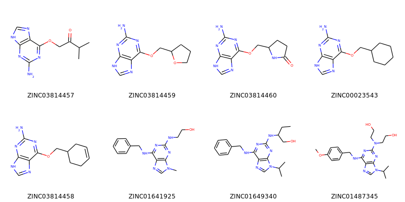
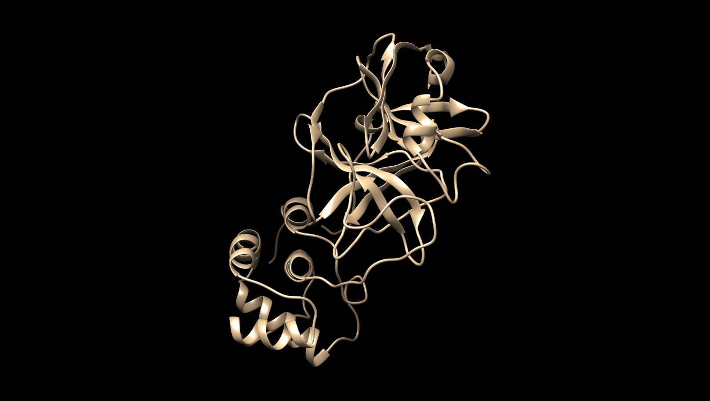

# Molecule Generation

	Molecular SMILE generation with recurrent neural networks

## Project Overview

The ability of deep learning algorithms to assess trends and provide insights from most corpora of data has shown much promise. AI has increasingly began to be implemented in some capacity in practically every major industry.

Inspired by the current COVID-19 virus outbreak, this project aims to explore a potential application for AI in the current health care industry: the use of AI as a tool or in assistance too **drug discovery** via drug generation.

## Viruses, Molecules and AI

Viruses reproduce and spread through the body through the use of either **one or both** of two cycles: the **lysogenic cycle** and the **lytic cycle**.

- **Lytic Cycle**

    - A virus injects a host cell with its genetic material (DNA)

    - The virus uses the host cell itself for the internal production of viral proteins.

- **Lysogenic Cycle**

    - A virus injects a host cell with its genetic material (DNA)

    - The virus DNA gets included in the DNA of the host cell itself

    - The host cell reproduces and replicates its DNA thus in turn replicating the DNA of the virus as well

In both cycles, the use of the host cell for the production of viral proteins is required for the further reproduction of the virus itself. The replication of virus DNA and animal DNA however **is different**, and this difference introduces a potential exploit in the fight against some viral diseases. 

#### Animal Replication vs. Viral Replication

While animal genes during DNA replication are copied one at a time, viral proteins are copied all at once. The viral proteins are made end-to-end in a single chain called a **polypeptide**. The polypeptide chains of the viral proteins on their own are not functional and must be split by a special enzyme called the **protease**, which is responsible for cutting the chains into functional viral proteins that can move on to infect other cells.

The protease is a crucial element in viral replication and thus by blocking the protease from seperating the peptide chains into functional viral proteins potential virus replication can be stopped. Certain compounds (aptly named protease inhibitors) inhibit the function of the protease enzyme and the virus can not spread.

### Ligand Discovery

The use of deep learing assisted molecule generation shows promise in helping scientists find a compound that acts as a potential cure for any certain deadly virus. By training a deep learning model on corpora of molecules, the model can learn an abstract representation of those molecules and be used to generate new novel ones potentially never seen before. This can catalyze the laborious process of drug discovery.

An AI model may generate a potential novel antiviral, and with the use of any [docking software](https://pyrx.sourceforge.io/), simulate and test the antiviral's binding affinity with a certain disease.

## Model

The model used in this project is a basic 2 layer GRU recurrent neural network trained on the [MOSES](https://github.com/molecularsets/moses) SMILE database.

#### MOSES Data Structure:

| SMILES        | SPLIT         |
| ------------- |:-------------:|
|CCCS(=O)c1ccc2[nH]c(=NC(=O)OC)[nH]c2c1| train |
|CC(C)(C)C(=O)C(Oc1ccc(Cl)cc1)n1ccnc1. | train |
|CC1C2CCC(C2)C1CN(CCO)C(=O)c1ccc(Cl)cc1| test  |
|...|...|

**SMILEs** (simplified molecular-input line-entry system) are a way of representing molecular compounds. SMILEs are written out as strings, and from them the molecule can be parsed and constructed. The problem of SMILE string generation is in essence equivalent to that of typical **seq2seq** text generation, and for that reason the same methods were used for this model.

The characters in the SMILE strings are mapped to one hot encoded values and given as input to the network. The GRU trains by attempting to predict the next character in the SMILE string. After training, the GRU will be given a small *"prime string"* as the start for attempting to predict the following characters.

### Model Architecture

The model used is a 2 layer bidirectional GRU-RNN with a hidden size of 150 each layer. 

The simple model alone is capable of somewhat understanding the SMILE molecule format and generating new molecules on it's own.

## Coronavirus and Drug Discovery

The COVID-19 Coronavirus has severely swept the world, and thus finding an antiviral is imperative to solving this catastrophic pandemic. Using the principles and methods discussed, this project will aim to use the novel molecules generated by the BI-GRU-RNN in combination with the [PyRx](https://pyrx.sourceforge.io/) docking software to test and identify their binding affinity with the the Coronavirus main protease.

|  |
| :-: |
| [Coronavirus Protease (Manually Removed Inhibitor N3)](https://www.rcsb.org/structure/6lu7) |

After running the model and generating a novel molecule, the molecule and Coronavirus protease will be both loaded into PyRx.

|    |
| :-: |
| **Example molecule generated by the model after training** |

## Testing Binding Affinity

Using the previously generated molecule example, it will be tested as a potential high affinity ligand with the Coronavirus main protease.

| The molecule and Coronavirus protease is loaded into PyRx |
| :-: |
|  |

||
| :-: |

||
| :-: |

Unfortunately this particular molecule generated by the GRU model is not a good ligand or inhibitor for the Coronavirus main protease due to its low binding affinity of **-4.6 (kcal/mol)**.

## Improvements and Optimizations

This is a simple and basic proof of concept project that shows the potential for the use of AI in the automation and facilitation of a drug discovery pipeline.

- **The model can be automated**

    - Currently the model can generate random molecules, and thus can be included in a program that continuously generates molecules and immediately tests their binding affinity, yielding the most potent compounds.

    - Unfortunately using large compute power to randomly generate molecules in hopes of getting lucky is extremely inefficient.

- **The model can be improved and expanded**

    - The model does not have to be random as it is in the use of this project. The beauty of deep learning is that any model can be expanded and retrained. Instead of random molecule generation the model can perhaps be trained on specifically popular inhibitors, and generate molecules in their likeness with a higher probability of being potentially useful. 

    - The use of the virus genome may also some how be incorporated as an input in hopes of further narrowing down search space.

- **Use more powerful models**

    - Though the simple 2 layered GRU model used is enough to demonstrate the concept of a machine learning model generating molecules on its own after learning from a corpus, it is hardly enough for a thorough and sophisticated understanding of the data.

    -  Architectures such as GANs and Variational Autencoders would hypothetically yield better performance and would be more suited to this application.

- **Known Problems**
    - The model converges to generating nothing but the prime string. It is advised to train and use the model before reaching this conversion as it generates full SMILEs better.

## Citations

> [In-Jin Jang. 2019. Artificial intelligence in drug development: clinical pharmacologist perspective. Translational and Clinical Pharmacology 27, 3 (September 2019), 87. doi:http://dx.doi.org/10.12793/tcp.2019.27.3.87](https://synapse.koreamed.org/Synapse/Data/PDFData/1179TCP/tcp-27-87.pdf)

> [Anon. 2015. Protease Inhibitors: Killing Viral Replication: AG Scientific Blog. (December 2015). Retrieved March 28, 2020 from https://agscientific.com/blog/2015/12/protease-inhibitors-kill/](https://agscientific.com/blog/2015/12/protease-inhibitors-kill/)

> [Christian Steinkühler. 1970. Viral Proteases. (January 1970). Retrieved March 28, 2020 from https://link.springer.com/referenceworkentry/10.1007/978-3-540-38918-7_146](https://link.springer.com/referenceworkentry/10.1007%2F978-3-540-38918-7_146)